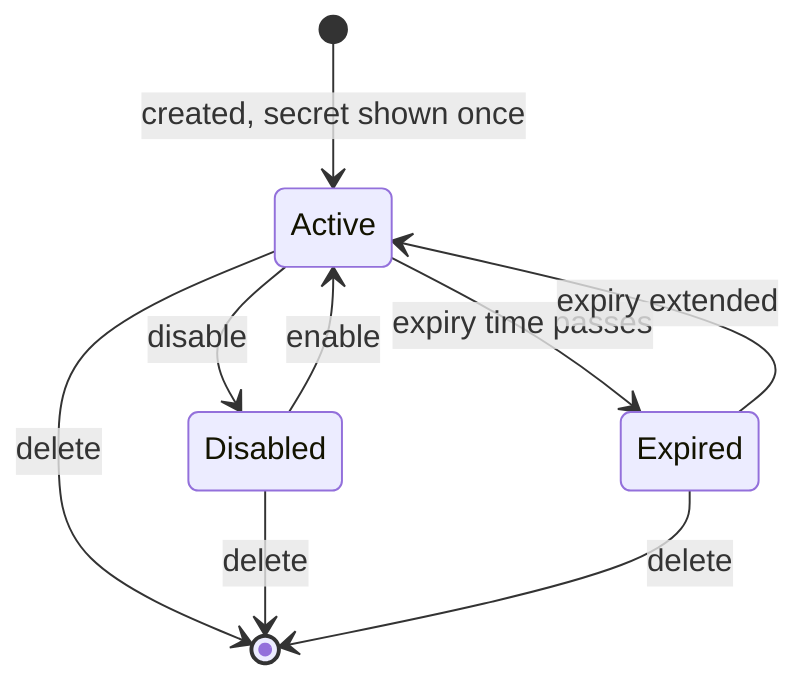

# API Key Lifecycle

Supports FR-KEY-05 and FR-KEY-07 in the [requirements](../spec/requirements.md).

```mermaid
stateDiagram-v2
    [*] --> Active: created, secret shown once
    Active --> Disabled: disable
    Disabled --> Active: enable
    Active --> Expired: expiry time passes
    Expired --> Active: expiry extended
    Active --> [*]: delete
    Disabled --> [*]: delete
    Expired --> [*]: delete
```

Only `Active` keys authenticate. All other states return the PowerDNS `401` response.
