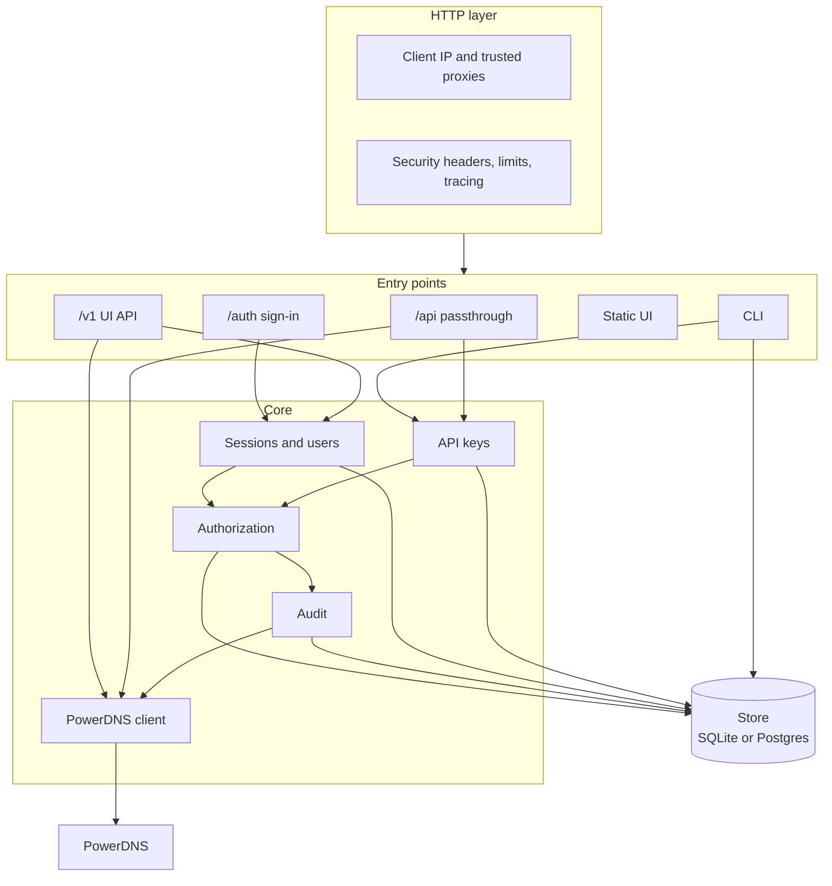

# Components

Supports [design section 2](../spec/design.md#2-components).

```mermaid
flowchart TD
    subgraph http["HTTP layer"]
        ip["Client IP and trusted proxies"]
        hdr["Security headers, limits, tracing"]
    end
    subgraph entry["Entry points"]
        api["/api passthrough"]
        v1["/v1 UI API"]
        auth["/auth sign-in"]
        static["Static UI"]
        cli["CLI"]
    end
    subgraph core["Core"]
        authz["Authorization"]
        audit["Audit"]
        keys["API keys"]
        sessions["Sessions and users"]
        client["PowerDNS client"]
    end
    store[("Store<br>SQLite or Postgres")]
    pdns["PowerDNS"]

    http --> entry
    api --> keys --> authz
    v1 --> sessions --> authz
    auth --> sessions
    authz --> audit --> client --> pdns
    api --> client
    v1 --> client
    cli --> keys & store
    keys & sessions & audit & authz --> store
```
