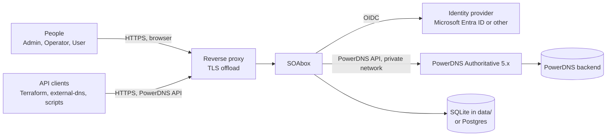

# System Context

Who and what SOAbox talks to. Supports [design section 1](../spec/design.md#1-overview).

```mermaid
flowchart LR
    people["People<br>Admin, Operator, User"] -->|"HTTPS, browser"| proxy["Reverse proxy<br>TLS offload"]
    tools["API clients<br>Terraform, external-dns, scripts"] -->|"HTTPS, PowerDNS API"| proxy
    proxy --> soabox["SOAbox"]
    soabox -->|"OIDC"| idp["Identity provider<br>Microsoft Entra ID or other"]
    soabox -->|"PowerDNS API, private network"| pdns["PowerDNS Authoritative 5.x"]
    soabox --> db[("SQLite in data/<br>or Postgres")]
    pdns --> pdnsdb[("PowerDNS backend")]
```
