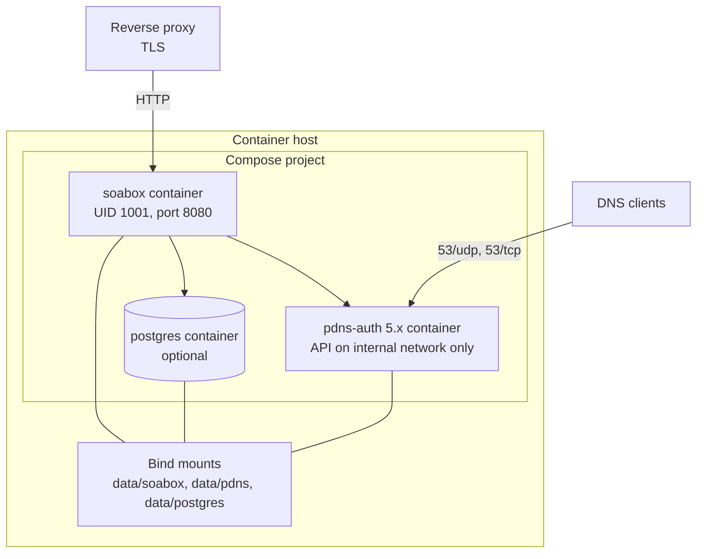

# Deployment

Supports [design section 9](../spec/design.md#9-deployment).

```mermaid
flowchart TB
    subgraph host["Container host"]
        subgraph compose["Compose project"]
            soabox["soabox container<br>UID 1001, port 8080"]
            pdns["pdns-auth 5.x container<br>API on internal network only"]
            pg[("postgres container<br>optional")]
        end
        data["Bind mounts<br>data/soabox, data/pdns, data/postgres"]
    end
    proxy["Reverse proxy<br>TLS"] -->|"HTTP"| soabox
    soabox --> pdns
    soabox --> pg
    soabox --- data
    pdns --- data
    pg --- data
    resolvers["DNS clients"] -->|"53/udp, 53/tcp"| pdns
```
