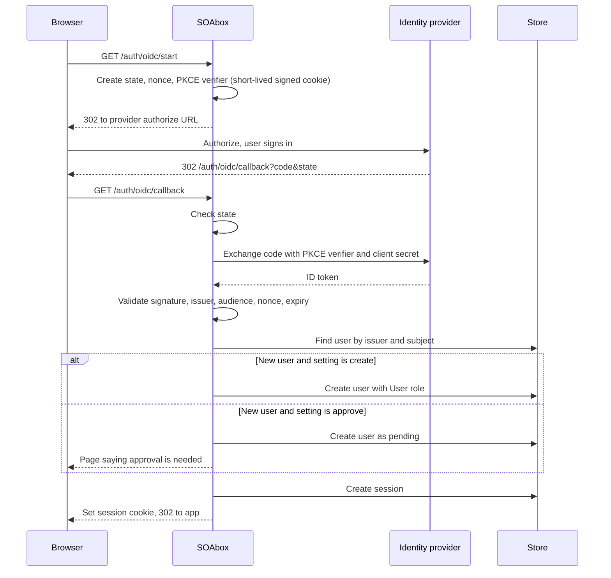

# OIDC Sign-In Sequence

Supports FR-AUTH-03 and FR-AUTH-04 in the [requirements](../spec/requirements.md).

```mermaid
sequenceDiagram
    participant B as Browser
    participant S as SOAbox
    participant I as Identity provider
    participant DB as Store

    B->>S: GET /auth/oidc/start
    S->>S: Create state, nonce, PKCE verifier (short-lived signed cookie)
    S-->>B: 302 to provider authorize URL
    B->>I: Authorize, user signs in
    I-->>B: 302 /auth/oidc/callback?code&state
    B->>S: GET /auth/oidc/callback
    S->>S: Check state
    S->>I: Exchange code with PKCE verifier and client secret
    I-->>S: ID token
    S->>S: Validate signature, issuer, audience, nonce, expiry
    S->>DB: Find user by issuer and subject
    alt New user and setting is create
        S->>DB: Create user with User role
    else New user and setting is approve
        S->>DB: Create user as pending
        S-->>B: Page saying approval is needed
    end
    S->>DB: Create session
    S-->>B: Set session cookie, 302 to app
```
