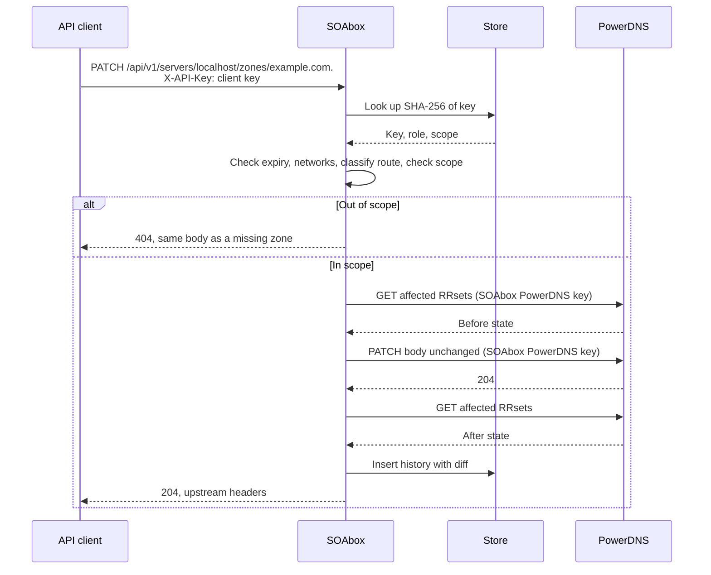

# Passthrough Write Sequence

A scoped key changes an RRset. Supports FR-KEY-01, FR-SCP-02, and FR-AUD-01 in the [requirements](../spec/requirements.md).

```mermaid
sequenceDiagram
    participant C as API client
    participant S as SOAbox
    participant DB as Store
    participant P as PowerDNS

    C->>S: PATCH /api/v1/servers/localhost/zones/example.com.<br>X-API-Key: client key
    S->>DB: Look up SHA-256 of key
    DB-->>S: Key, role, scope
    S->>S: Check expiry, networks, classify route, check scope
    alt Out of scope
        S-->>C: 404, same body as a missing zone
    else In scope
        S->>P: GET affected RRsets (SOAbox PowerDNS key)
        P-->>S: Before state
        S->>P: PATCH body unchanged (SOAbox PowerDNS key)
        P-->>S: 204
        S->>P: GET affected RRsets
        P-->>S: After state
        S->>DB: Insert history with diff
        S-->>C: 204, upstream headers
    end
```
