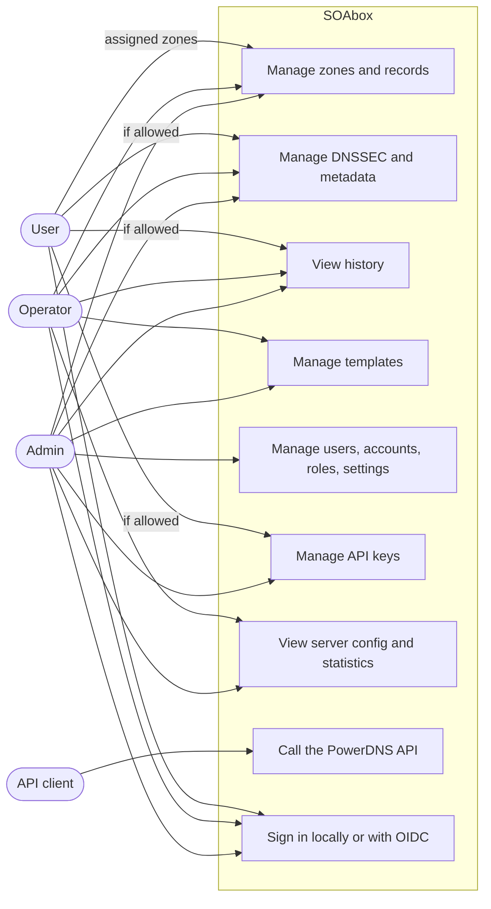

# Actors And Use Cases

Supports [requirements section 3](../spec/requirements.md#3-actors).

```mermaid
flowchart LR
    admin(["Admin"])
    operator(["Operator"])
    user(["User"])
    client(["API client"])

    subgraph soabox["SOAbox"]
        uc1["Manage zones and records"]
        uc2["Manage DNSSEC and metadata"]
        uc3["View history"]
        uc4["Manage templates"]
        uc5["Manage users, accounts, roles, settings"]
        uc6["Manage API keys"]
        uc7["View server config and statistics"]
        uc8["Call the PowerDNS API"]
        uc9["Sign in locally or with OIDC"]
    end

    admin --> uc1 & uc2 & uc3 & uc4 & uc5 & uc6 & uc7 & uc9
    operator --> uc1 & uc2 & uc3 & uc4 & uc7 & uc9
    user -->|"assigned zones"| uc1
    user -->|"if allowed"| uc2 & uc3 & uc6
    user --> uc9
    client --> uc8
```
